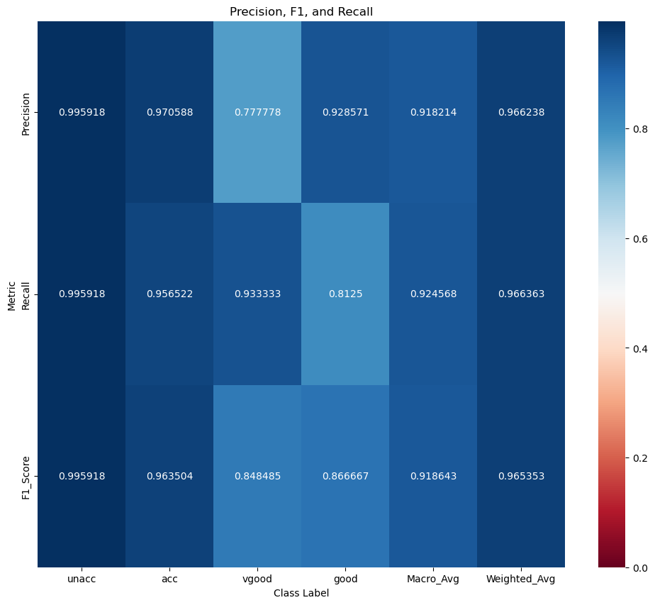

# Car Evaluation with Decision Tree Learning From Scratch
The program requires matplotlib, seaborn, numpy and pandas.

# Model Performance

This implementation ID3 learning decision tree performed very well with the dataset used. Since the model consistently performed at a high level of
accuracy (mid to high 90s) as a binary tree, additional branches were not added to avoid unnecessarily complexity. The model evaluations may be subject
to bias, and may not generalize well to a larger test set which has a more even distribution. This is because the
test set did not have an even distribution of classes, with 72.2% of all test feature vectors belonging to the unacc class. 
Additionally, the distribution of the training data was never verified, and could have similar
problems to the test set. Therefore, to improve the model, the distribution of the training data
should be explored, and the model should be tested on more examples for the other classes,
particularly the good and vgood classes. Overall, for this use case, the model
performance was exemplary based upon the precision, F1 and recall scores and the confusion matrix.

# Instructions
The program will print the train test split and the accuracy of the model by calling the `main()` function with the filename of the input data csv, the training and testing data
sizes, and whether the user wants performance evaluation plots to be shown upon completion or not. 
