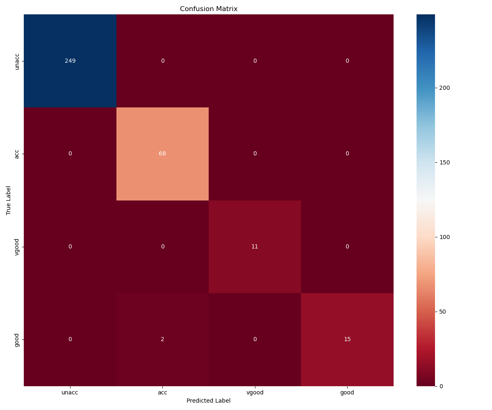
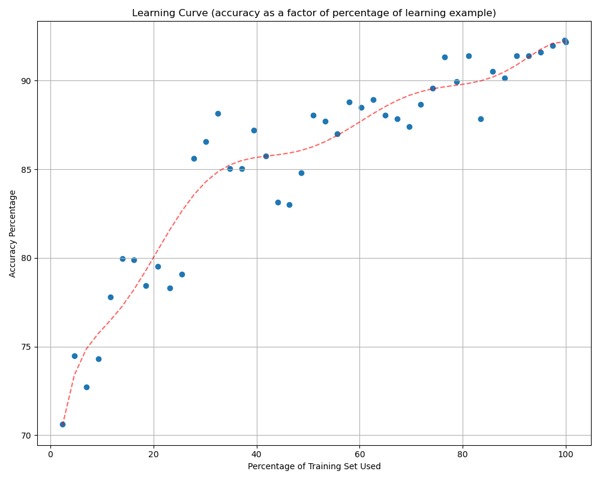

# Car Evaluation with Decision Tree Learning From Scratch
The aim of this project was to implement a learning decision tree from scratch which could correctly evaluate cars based on
the 6 features in the car.csv dataset. The car.csv dataset includes 1728 cars with features: buying
price, cost of maintenance, number of doors, capacity in terms of persons to carry, the relative size of
luggage boot and the estimated safety of each car. The final column of the dataset evaluates the car
into 1 of 4 classes: unacceptable, acceptable, good or very good.

Everything to do with the model including the train/test split function was implemented from scratch.

The program requires matplotlib, seaborn, numpy and pandas.

# Model Performance
## Confusion Matrix

The

## Learning Curve

The learning curve of the model can be gathered by `iterative_id3_build()` which builds the tree on an
increasingly large percentage of the training data. It returns this information in the form of 2 arrays:
fractions, accuracies. `fractions[0], accruacies[0]` would correspond to the accuracy of the model when trained on `fraction[0]`*100% of the data.


# Instructions
The program will print the train test split and the accuracy of the model by calling the `main()` function with the filename of the input data csv, the training and testing data
sizes, and whether the user wants performance evaluation plots to be shown upon completion or not. 


# How It Works
The decision tree is built recursively by the ```id3_build_tree()``` function with inputs `X` and `y` which
are arrays of the input and outputs of the training data. `id3_build_tree()` returns the root node of the decision tree. Then, to make a decision
for feature vector `x` based off the decision tree, `make_decision()` can be called with the root node
and x passed through. This will return the decision for x.